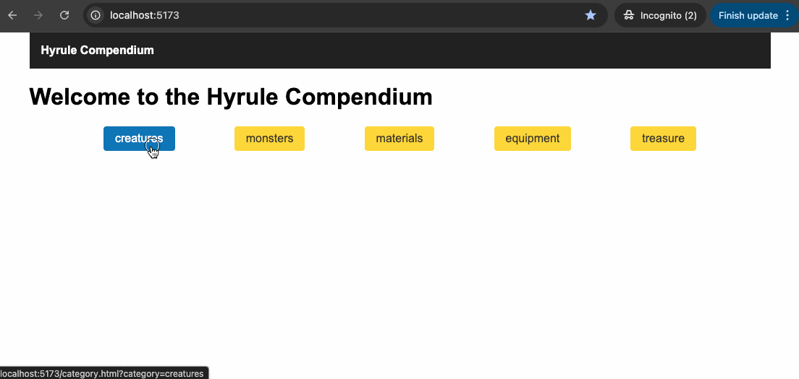

# Assignment 4: Final Project – Complete Front-End Application (Web Component Focused)

**Weight:** 20%  
**Submission:** Via GitHub Classroom (starter files provided)
**Deployed App URL:** ***<YOUR APP URL HERE>***

[Clone](#cloning-instructions) this repo to your computer and then follow the specs below to complete this assignment. When you are done, [submit](#submission-instructions) your solution. Also be sure to put your name in the required parts of your assignment submission.

----

## Cloning Instructions

Follow these instructions to clone this repository to your computer.

1. Open **Visual Studio Code**.
2. Open the command palette and type `clone`. Select the `Git: Clone` option.
   - *Press either <kbd>F1</kbd> **or** <kbd>ctrl</kbd> + <kbd>shift</kbd> + <kbd>p</kbd> to open the command palette.*
3. Click `Clone from GitHub` and follow the prompts.
4. When a pop-up appears in VS Code to open the repository, open it in the current window.

## Submission Instructions

> *Note: Unless your instructor explicitly offers different submission instructions, you are expected to follow the process outlined here.*

**All** your work for this assignment should be done on a ***local copy* of the assignment** that exists on ***your* computer**.

To submit your work, perform the git *commit* and *push* process demonstrated by your instructor.

> **Do not upload** your assignment submission using GitHub's file-upload feature. Your instructor may assign a mark of zero (0%) for this assignment if you upload file(s) instead of using the git *commit* and *push* process.

## Overview

In this final assignment, you will build a fully functional front-end web application using **custom web components**. You will build a multi-page front-end application that allows users to browse and explore the [Hyrule Compendium](https://gadhagod.github.io/Hyrule-Compendium-API/#/). You will deploy your application to a cloud platform such as **Vercel** or **Netlify**.

## Learning Outcomes Addressed

- Apply advanced JavaScript techniques to manipulate data and the DOM.
- Implement meaningful user interactions using event handling and dynamic DOM updates.
- Integrate a provided API backend to exchange data.
- Design and implement reusable web components with encapsulated styling and state management.

## What You'll Build

A multi-page front-end application that includes:

- Reusable, modular **custom web components**.
- **Dynamic content updates** based on API data.
- **Encapsulated styling** using Shadow DOM and CSS custom properties.
- **Internal state management** within components.
- **API Integration** with the [Hyrule Compendium API](https://gadhagod.github.io/Hyrule-Compendium-API/#/compendium-api).
- **Deployment** to a cloud platform.

## Assignment Tasks

### 1. Web Components
- You must create and use the following custom elements:
  - `<entry-card>` – Self-contained component that displays summary and expandable detail view of an entry.
  - `<app-button>` – Reusable, customizable button component used throughout the application.
  - `<app-header>` – Simple navigation header for page layout and branding.
- Implement key UI sections using the three custom components listed above. Use slots, attributes, or properties to ensure reusability and configuration flexibility where appropriate or directed.

#### `app-header`
The required styling and markup required for the component are as follows:

  ```css
    nav {
      background-color: #222;
      color: #fff;
      padding: 1rem;
      display: flex;
      align-items: center;
      justify-content: space-between;
    }

    a {
      color: #fff;
      text-decoration: none;
      font-weight: bold;
    }

    a:hover {
      text-decoration: underline;
    }
  ```

  ```html
    <nav>
      <a href="index.html">Home Text</a>
    </nav>
  ```

- Create the `app-header.js` file for the app-header component in the `js/components/` directory.
- Create an `AppHeader` class for the custom component.
- Build a template for the component.
  - Make use of a `slot` with the name `home-text` so the link text (i.e., "Home Text") can be dynamically assigned.
- Ensure that the styles are scoped within the component.
- Utilize the appropriate lifecycle method to render the component.
- Register the component for use in the DOM.

#### `app-button`  
The required styling and markup required for the component are as follows:

```css
a, button {
  display: inline-block;
  padding: 0.5rem 1rem;
  border: none;
  border-radius: 4px;
  background-color: #eee;
  color: #000;
  cursor: pointer;
  font-size: initial;
  text-decoration: none;
}
a:hover, button:hover {
  background-color: #333;
  color: #fff;
}
```

```html
  <button>
    Click Me
  </button>
```

- Create the `app-button.js` file for the component in the `js/components/` directory.
- Create an `AppButton` class for the custom element.
- Build a template for the component.
  - Make use of a `slot` with the name `label` so the button text (i.e., "Click Me") can be dynamically assigned.
- Use an observed `href` attribute to determine if the component renders as a `<button>` or `<a>` link.
  - If the `href` attribute is present, replace the `button` in the shadow DOM with an `a` tag.
- Ensure styles are scoped within the component. *This step will require some planning.*
- Utilize the appropriate lifecycle method to render the component, and also render on observed attribute changes (i.e., `href`).
- Utilize CSS vars for custom styling the following:
  - `--app-button-bg` for the `a, button` background colour with default `#eee`
  - `--app-button-color` for the `a, button` colour with default `#000`
  - `--app-button-bg-hover` for the `a:hover, button:hover` background colour with default `#333`
  - `--app-button-color-hover` for the `a:hover, button:hover` colour with default `#fff`
- Register the component for use in the DOM.

#### `entry-card`  
The required styling and markup required for the component are as follows:

```css
  .card {
    border: 1px solid #ccc;
    padding: 1rem;
    margin: 0.5rem 0;
    border-radius: 4px;
    background-color: #fff;
  }
  .card img {
    max-width: 200px;
    display: block;
    margin-bottom: 0.5rem;
  }
  .extra {
    display: block;
  }
  .extra.extra-hidden {
    display: none;
  }
  button {
    margin-top: 0.5rem;
  }
```

```html
<div class="card">
  <h3>NAME</h3>
  
  <p><strong>Category:</strong> CATEGORY</p>
  <!-- Use an app-button here with id="toggle-btn" and label slot "Toggle Details" -->
  <div id="details" class="extra extra-hidden">
    <p><strong>Description:</strong> DESCRIPTION</p>
    <p><strong>Common Locations:</strong> LOCATIONS</p>
    <p><strong>Drops:</strong> DROPS</p>
  </div>
</div>
```

- Create the `entry-card.js` file for the component in the `js/components/` directory.
- Include the required `app-button` component.
- Create an `EntryCard` class for the custom element.
- Build a template for the component.
  - Make use of `slot`s for all output values:
    - Slot named `name` for **"NAME"**
    - Slot named `image` for **"IMAGE"**
    - Slot named `category` for **"CATEGORY"**
    - Slot named `description` for **"DESCRIPTION"**
    - Slot named `locations` for **"LOCATIONS"**
    - Slot named `drops` for **"DROPS"**
- Assign slot values dynamically based on incoming `entry` data.
  - You will need to replace the `image` slot child with an `img` element.
- You cannot render an `<entry-card>` without setting it's data
  - Throw an `Error` with the message "No data has been set".
- Use internal private Boolean state `#expanded` (with `expanded` property get and set) to toggle the visibility of additional information inside `div#details` of the card.
  - Use the `<app-button>` component to trigger the toggle behavior (add an event listener).
  - Setting the `expanded` property will have the effect of either adding or removing the `extra-hidden` class from the `div#details` element.
- Use internal state to hold the data for the entry (i.e., the returned entry data from the API).
  - Include an internal private object state `#data` (with `data` property get and set) that, when set, assigns the incoming data value to the internal `#data` state. **Be sure to render the component when the data is set.**
- Ensure styles are scoped within the component.
- Utilize the appropriate lifecycle method to render the component.
- Register the component for use in the DOM.

### 2. Pages

#### Home Page

Display `app-button`s for each category (Creatures, Monsters, Materials, Equipment, Treasure). You may use a hard-coded array of categories to programatically add them to the page in `main.js`.

##### `index.html`
- Include an `app-header` component in the required location (see the existing comment)
  - Use the slot to update the home text to: **"Hyrule Compendium"**.
- Render `app-button`s for each category (Creatures, Monsters, Materials, Equipment, Treasure) in the `section#category-buttons` element. Each `app-button` must have a uniqe label (the category name) and `href` attribute linking to the category page.
  - Use the following href format for each category: `category.html?category=<CATEGORY>` where **`<CATEGORY>`** should be replaced with the unique category value.
  - Use any means available to you to include the components on the page. 
    - OPTION 1: Manually enter the components into `index.html`
    - OPTION 2: You may use a hard-coded array of categories and programatically add them to the page from `main.js`.

##### `js/main.js`
- Ensure the required custom components are included for use.
- If you have chosen to programatically render all app-buttons to the page, do so here.

The page should now render the `app-header` with appropriate text, and the five `app-buttons` with functional navigation.

#### Category Page

##### `category.html`
- Include an `app-header` component in the required location (see the existing comment)
  - Use the slot to update the home text to: **"Hyrule Compendium"**.

##### `js/category.js`
- Ensure the required custom components are included for use.

Test your `entry-card` component by rendering one with hard-coded data in the `section#entries-list` element.

### 3. API Integration
Use the [Hyrule Compendium API](https://gadhagod.github.io/Hyrule-Compendium-API/#/):
- `GET /category/{category}` – Fetch entries by category

The `category.js` file is responsible for dynamically loading the correct entries for the selected category and rendering them on the page using your `<entry-card>` component.

Follow these steps to complete this file:

1. **Get Selected Category**
   - Extract the selected category from the query string in the URL.
   - Use the [URLSearchParams](https://developer.mozilla.org/en-US/docs/Web/API/URLSearchParams) API to retrieve the category from the URL.

2. **Fetch Entries by Category**
   - Use the fetch API to retrieve the entry data.

3. **Render `<entry-card>` Components**
   - For each entry returned from the API:
     - Create a new `<entry-card>` element.
     - Assign the `entry` data property.
     - Append the element to the container.

4. **Test Your Work**
   - Ensure that when you visit `category.html?category=monsters` or another category, the corresponding entries appear and display correctly inside your `<entry-card>` components.

### 4. Deployment
- Deploy your completed front-end application to **Vercel**, **Netlify**, or another platform.
- Ensure that the deployed application mirrors your local development version.
- Update this README file with the URL of your deployed app for grading (**See the placeholder at the top of the file**).

## Sample Run - Load Customers
> *NOTE: CSS vars have been applied to alter the colors in the sample run*



## Starter Files

You will receive a GitHub Classroom repository that includes:

- `src/` – Starter files for the frontend application.
- `src/css/styles.css` – Global styles for the application.
- `src/js/main.js` – Starter for initializing the home page.
- `src/js/category.js` – Starter for initializing the category page.
- `src/js/components/` – Folder for custom web components.
- `README.md` – Assignment overview and instructions.

Your repository also includes **GitHub Actions** to automatically run tests on your code and provide feedback.

## Evaluation Criteria (20 Marks Total)

__NOTE: You must demonstrate incremental development of your solution. This means that you must begin work on your solution as soon as possible and commit often to the assignment repository. Each commit must demonstrate functional improvements to the solution. If you submit code that differs greatly from what was demonstrated in class, it must be documented (e.g. comments) and you may be asked to provide a verbal explanation of how the code works to your instructor. Failure to show incremental work during the assignment period, or failure to document techniques used that were not shown in class, will result in loss of marks of up to 20%.__

| Criteria                             | Marks | Description |
|-------------------------------------|-------|-------------|
| Web Component Architecture          | 6     | Components are modular, functional, and reusable across the application.|
| Styling & Shadow DOM                | 4     | Encapsulated styles and CSS custom properties are implemented effectively. |
| State Management & Dynamic Behavior | 4     | Components track internal state (e.g., expanded/collapsed detail views) and update the UI dynamically based on user interactions. |
| API Integration                     | 2     | Application fetches data from the required API and renders it dynamically. |
| Deployment          | 2     | Application is successfully deployed to a public hosting platform (e.g., Netlify, Vercel). |
| Code Quality        | 2     | Code is modular, well-commented, consistently formatted, and easy to follow. Naming conventions and structure support maintainability. |

## Tips for Success

- Plan your component structure early and keep it modular.
- Test your data integration with the provided API before deployment.
- Document your custom elements and any reusable logic.
- Comment your code and commit your progress frequently.
- Validate your final deployed app for full functionality.

## Submission Instructions

1. Complete your project in your GitHub Classroom repository.
2. Push commits regularly with clear messages during development to track progress.
3. Submit your deployed application URL in the repository `README.md`.
4. GitHub Actions will run tests to evaluate your solution.
5. Your instructor will assess the repository and deployment.
